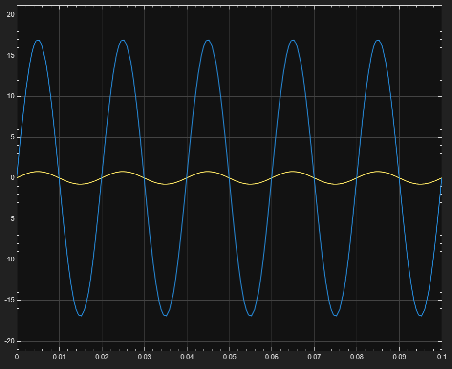
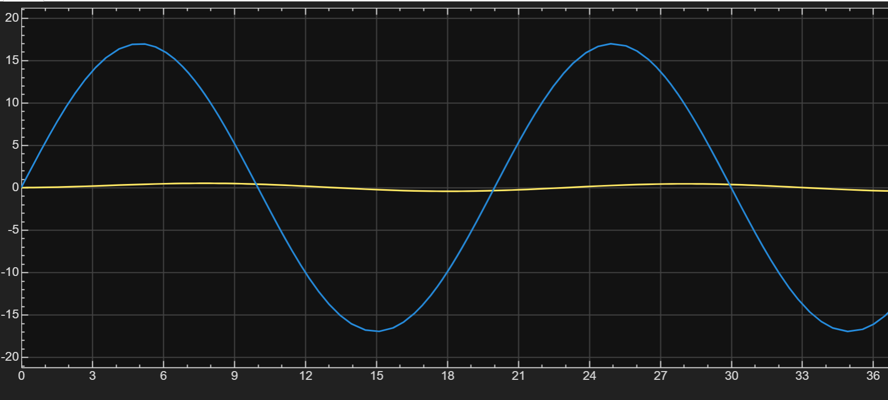
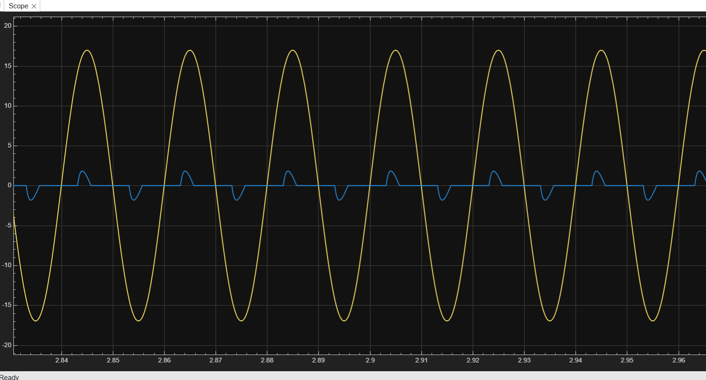
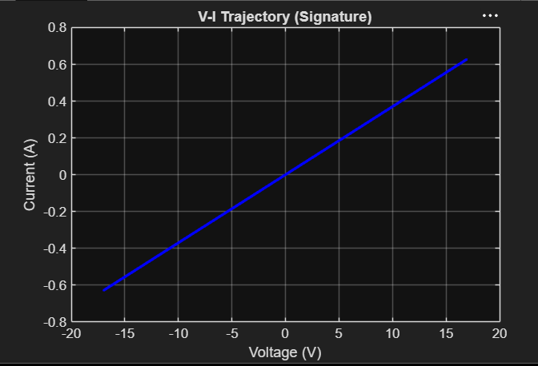
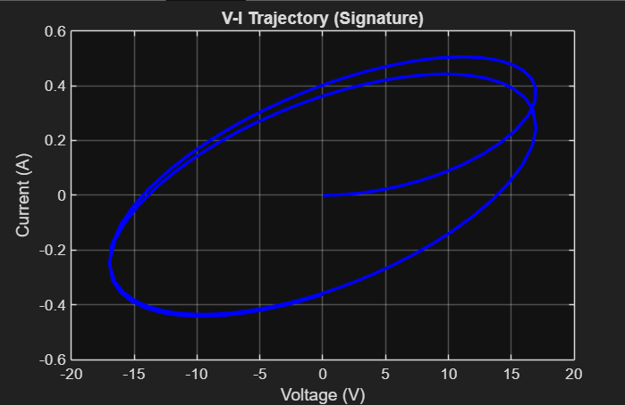
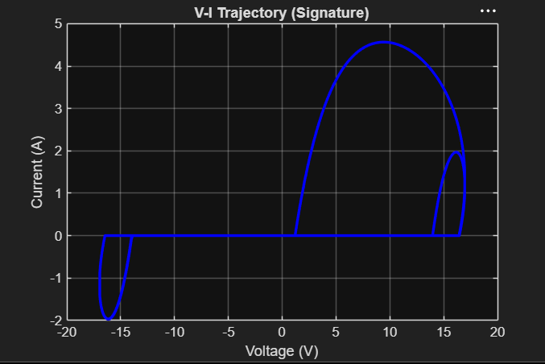

# Smart-load-ID
Smart load monitoring and classification system using ESP32 and Python.
📌 Overview
SMART LOAD ID is an intelligent energy monitoring system that identifies electrical appliances in real time using voltage-current signature analysis and machine learning classification.
The system performs:
Data acquisition via ESP32
Signal processing & filtering
Feature extraction (RMS, PF, THD, Crest Factor)
ML-based load classification
IoT monitoring via Blynk
Real-time alerts via Telegram

🧠 System Architecture
ESP32 Sensors → Signal Acquisition → Python Processing → Feature Extraction → ML Model → Classification → IoT Dashboard + Telegram

🖼️ Project Visuals
🔌 Voltage & Current Waveforms

📊 V-I Trajectory

📱 Blynk Dashboard

⚙️ Features
⚡ Real-time voltage & current acquisition
📡 ESP32 ↔ Python communication
🔊 Digital signal filtering
📊 Power analysis (RMS, PF, THD)
🧠 Machine Learning classification
📈 V-I trajectory visualization
☁️ IoT cloud monitoring (Blynk)
📲 Telegram smart alerts
💰 Energy & cost estimation

🔌 Hardware Setup
ESP32 Development Board
Voltage Sensor Module
Current Sensor (ACS712 / equivalent)
Resistive Load
Inductive Load
Nonlinear Load

💻 Software Stack
Category	Tools
Language	Python, Embedded C
ML	Scikit-learn, NumPy, Pandas
Visualization	Matplotlib, SciPy
Communication	PySerial
IoT	Blynk Cloud, Telegram Bot API

📊 Load Classification
🔴 Resistive Load
PF ≈ 1
Linear waveform
No phase shift
🟡 Inductive Load
PF ≈ 0.7
Phase shift present
Elliptical V-I curve
🔵 Nonlinear Load
High THD
Distorted waveform
Harmonic presence

🤖 Machine Learning Pipeline
Data Acquisition
Filtering & Preprocessing
Feature Extraction
Model Training
Load Prediction
Visualization + Reporting

📡 IoT Integration
☁️ Blynk Dashboard
Displays:
Voltage
Current
Power
Load Type
Energy Consumption
📲 Telegram Bot
Sends:
Real-time load detection
Power quality metrics
Alerts & summaries
📁 Project Structure
SMART-LOAD-ID/
│
├── ESP32_Code/
├── Python_Code/
├── Dataset/
├── Model/
├── Images/
├── Output/
└── README.md
🚀 Future Improvements
Deep Learning-based NILM
Web dashboard (React / Flask)
Edge AI on ESP32
Smart home automation integration
Real-time cloud database
## 👥 Team Members
### 👩‍💻 Hoda Mahmoud
🔗 LinkedIn: [https://www.linkedin.com/in/your-profile](https://www.linkedin.com/in/hoda-mahmoud-b3327736b?utm_source=share_via&utm_content=profile&utm_medium=member_android)
---
### 👩‍💻 Nesreen Elemairy
🔗 LinkedIn: [https://www.linkedin.com/in/your-profile](https://www.linkedin.com/in/nesreen-elemairy-a9078635a?utm_source=share_via&utm_content=profile&utm_medium=member_android)
---
### 👩‍💻 Sama Mohamed
🔗 LinkedIn: [https://www.linkedin.com/in/your-profile](http://linkedin.com/in/sama-mohamed-005425357)
---
### 👩‍💻 Fatma Nagah
🔗 LinkedIn: [https://www.linkedin.com/in/your-profile](https://www.linkedin.com/in/fatma-nagah-b437a236b?utm_source=share&utm_campaign=share_via&utm_content=profile&utm_medium=android_app)
---
### 👩‍💻 Fatma Emad
🔗 LinkedIn: [https://www.linkedin.com/in/your-profil](https://www.linkedin.com/in/fatma-emad228?utm_source=share&utm_campaign=share_via&utm_content=profile&utm_medium=android_app)e
---
### 👩‍💻 Aisha Belal
🔗 LinkedIn: [https://www.linkedin.com/in/your-profile](http://linkedin.com/in/aisha-belal-10b78b376)
---
### 👩‍💻 Fatma Elsaber
🔗 LinkedIn: [https://www.linkedin.com/in/your-profile](https://www.linkedin.com/in/fatma-elsaber-9ab1b830b?utm_source=share_via&utm_content=profile&utm_medium=member_android)
---
### 👩‍💻 Zamzam Ali
🔗 LinkedIn: [https://www.linkedin.com/in/your-profile](http://linkedin.com/in/zamzam-ali-6314b4372)
---
📜 License
This project is intended for educational and academic research purposes only.
